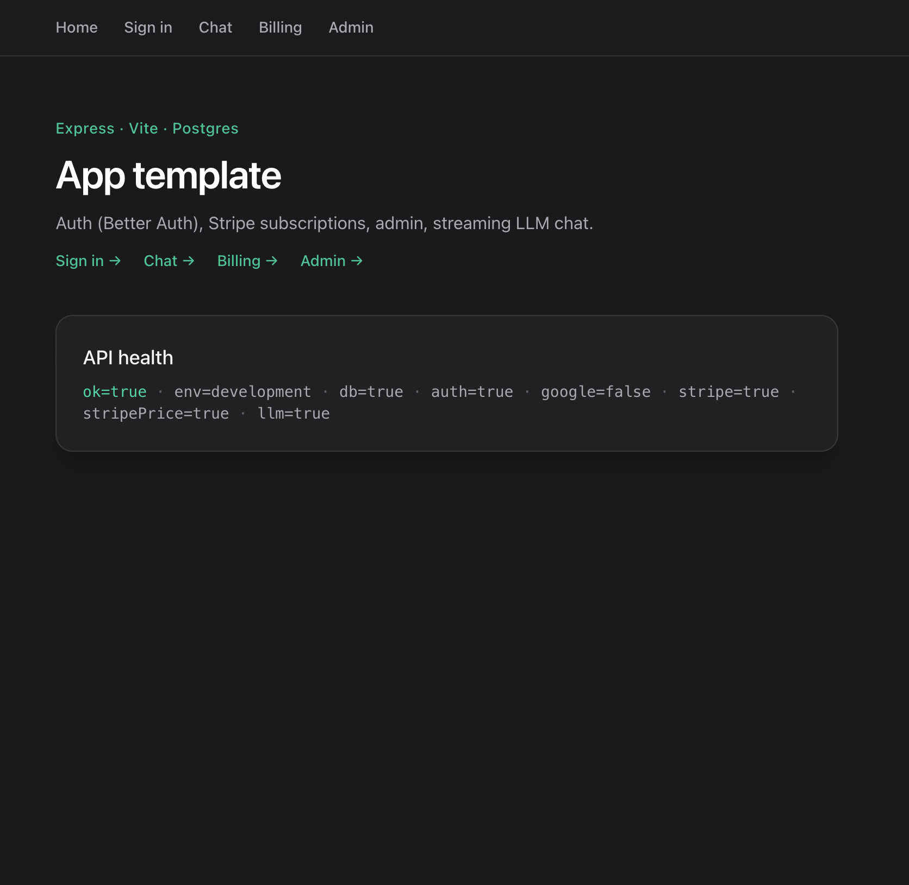
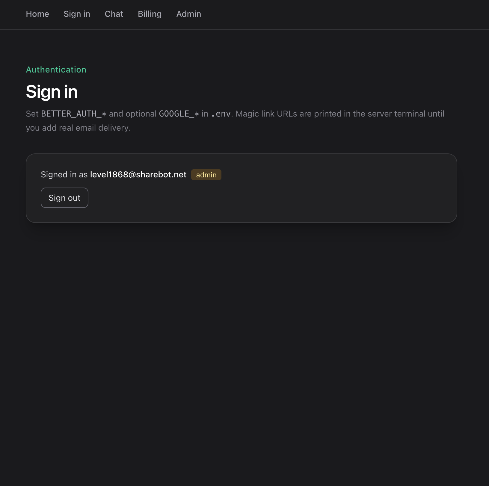
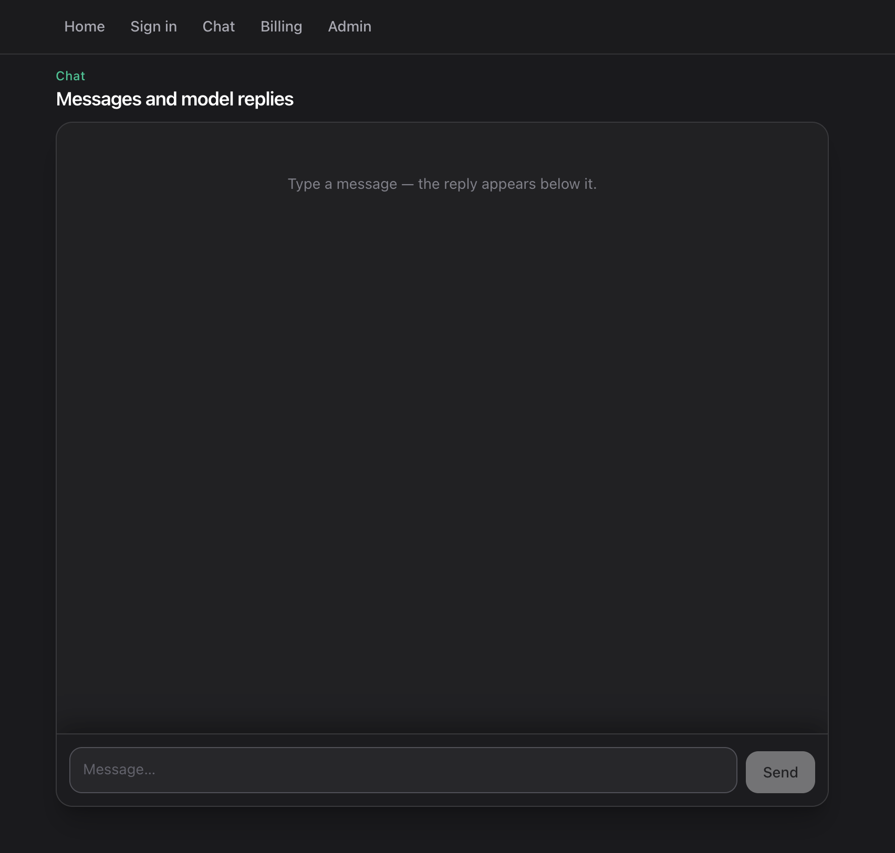
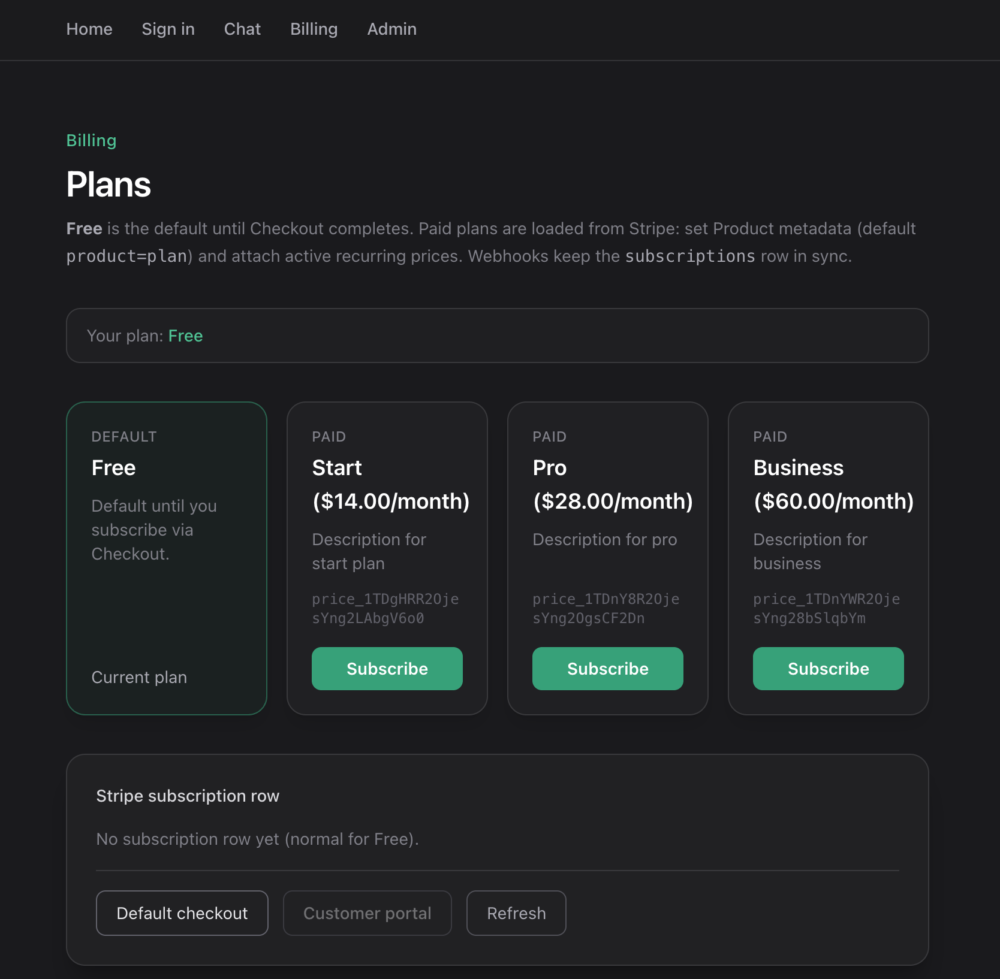
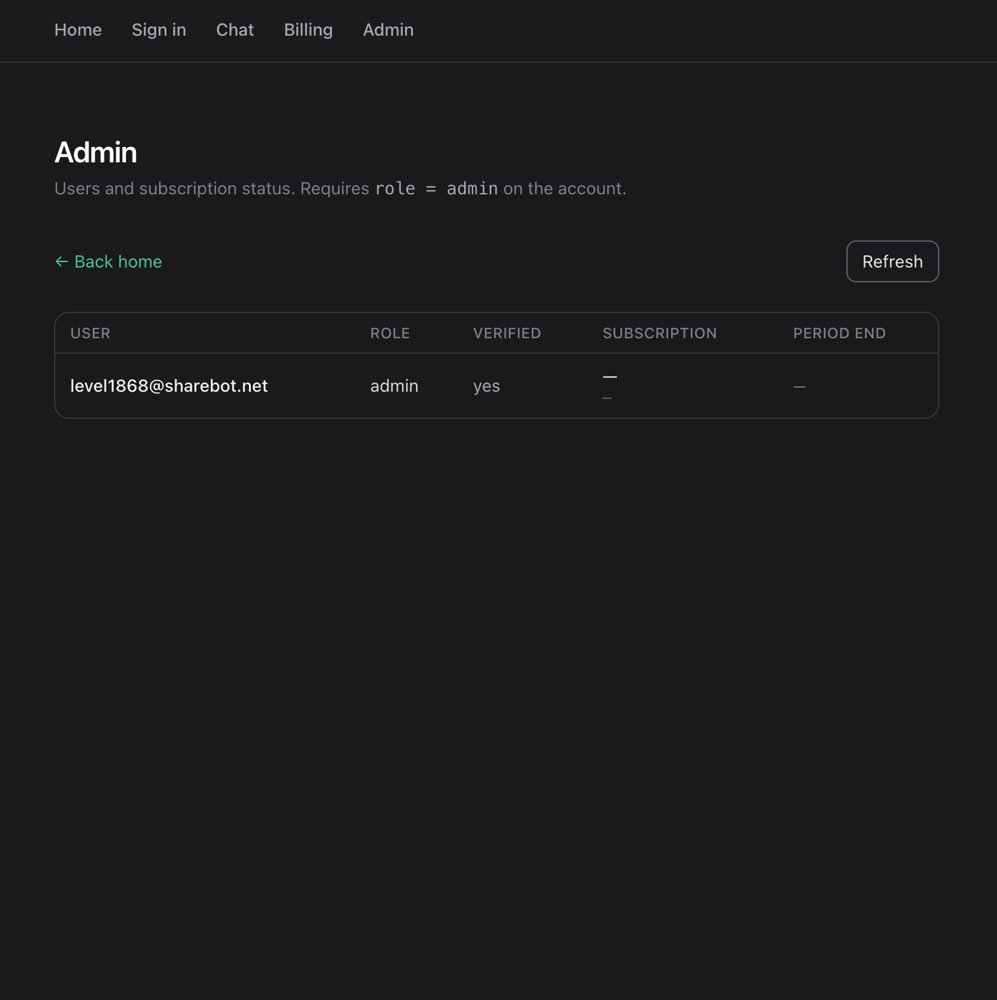

# Template: auth, Stripe subscriptions, admin, LLM chat

Single **Node** process: **Express** serves the API and, in dev, **Vite** middleware; in production it serves static files from `client/dist`. **PostgreSQL** + **Drizzle**, **Better Auth** (sessions in the DB), **Stripe** (checkout + webhooks), streaming chat (**OpenAI** or **Anthropic**), and an **`admin`** role for `/admin`.

## UI preview

### Home



### Sign in



### Chat



### Billing



### Admin



## Local setup

```bash
npm install
cp .env.example .env
docker compose -f docker/docker-compose.yml up -d
npm run db:migrate   # or npm run db:push for a throwaway DB
npm run dev
```

Open **http://localhost:3000**. If the port is busy, set `PORT` in `.env`.

### Required env

| Variable | Purpose |
| -------- | ------- |
| `DATABASE_URL` | Postgres (example uses `localhost:5433` with the bundled compose file) |
| `BETTER_AUTH_SECRET` | Random string, **at least 16 characters** |
| `BETTER_AUTH_URL` | Exact browser origin, e.g. `http://localhost:3000` |

### Google Sign-In (optional)

1. Open [Google Cloud Console](https://console.cloud.google.com/) → your project (create one if needed).
2. **APIs & Services** → **Credentials** → **Create credentials** → **OAuth client ID** (type: **Web application**).
3. Under **Authorized redirect URIs**, add:  
   `{BETTER_AUTH_URL}/api/auth/callback/google`  
   e.g. `http://localhost:3000/api/auth/callback/google`.
4. Copy **Client ID** → `GOOGLE_CLIENT_ID`, **Client secret** → `GOOGLE_CLIENT_SECRET` in `.env`.

### Stripe (optional)

1. Create or use a [Stripe](https://dashboard.stripe.com/) account (use **Test mode** for local dev).
2. **Developers** → **API keys**: copy **Secret key** → `STRIPE_SECRET_KEY` in `.env`.
3. **Product catalog**: create **Products** for your plans. On each product, set **Metadata** to match the app default: key `product`, value `plan` (or set `STRIPE_PLAN_METADATA_KEY` / `STRIPE_PLAN_METADATA_VALUE` in `.env`). Attach at least one **active recurring Price** per product so `/billing` can list them.
4. **Webhooks**: **Developers** → **Webhooks** → **Add endpoint** → URL:  
   `https://<your-public-host>/api/webhooks/stripe`  
   Subscribe to events the app handles (e.g. `checkout.session.completed`, subscription and invoice events). Copy the endpoint **Signing secret** (`whsec_…`) → `STRIPE_WEBHOOK_SECRET` (**not** the URL).
5. **Local testing**: either install [ngrok](https://ngrok.com/) (or similar), expose `localhost:3000`, and use the **https** ngrok URL as the webhook endpoint in Stripe, **or** run the [Stripe CLI](https://stripe.com/docs/stripe-cli):  
   `stripe listen --forward-to localhost:3000/api/webhooks/stripe`  
   and put the CLI **signing secret** into `STRIPE_WEBHOOK_SECRET`.

Enable the [Customer portal](https://dashboard.stripe.com/settings/billing/portal) if you use **Manage billing** in the app.

### LLM chat (optional)

- **OpenAI**: [platform.openai.com](https://platform.openai.com/) → **API keys** → create a key → `OPENAI_API_KEY` in `.env`.
- **Anthropic**: [console.anthropic.com](https://console.anthropic.com/) → API keys → `ANTHROPIC_API_KEY` in `.env`.

At least one of these is needed for `/api/chat`. If both are set, the server prefers OpenAI unless the client picks a provider.

### Other notes

- **Admin**: after first sign-in, run SQL:  
  `UPDATE "user" SET role = 'admin' WHERE email = 'you@example.com';`
- **Magic link**: without email configured, the sign-in link is printed in the **server** terminal.

## Production

1. Set the same variables in your host or platform secrets. Use **`NODE_ENV=production`**, **`DATABASE_URL`**, **`BETTER_AUTH_SECRET`**, and **`BETTER_AUTH_URL`** as users see it (usually `https://…`).

2. Monolith (API + SPA in one process):

   ```bash
   npm ci
   npm run build
   npm start
   ```

3. **Docker prod stack** (`docker/docker-compose.prod.yml`): uses **pre-built images** only (`BACKEND_IMAGE`, `FRONTEND_IMAGE`, `MIGRATE_IMAGE` — no `build` on the server). CI builds and pushes them to **GHCR**; the server **pulls**, runs **migrations**, then **`up -d`**. Set **`BETTER_AUTH_URL`** to the URL users open (e.g. `http://localhost:8080`). Wire app secrets into **`backend`** via `env_file` or environment as you prefer.

## Scripts

| Command | Purpose |
| ------- | ------- |
| `npm run dev` | Development |
| `npm run build` | `vite build` + server bundle |
| `npm start` | `node dist/server/index.js` |
| `npm run db:migrate` | Apply SQL migrations |
| `npm run db:push` | Push schema (handy locally) |
| `npm run db:generate` | Generate migrations from `schema/` |
| `npm run db:studio` | Drizzle Studio |

## GitHub Actions (build + deploy)

Workflow: [`.github/workflows/ci.yml`](.github/workflows/ci.yml).

**What runs where**

| Where | What |
| ----- | ---- |
| **GitHub** | `npm ci` → `tsc` → `npm run build` (sanity check). Then **three Docker images** are built and pushed to **GHCR**: `…/backend`, `…/frontend`, `…/migrate` (each tagged with the commit SHA and `latest`). |
| **Server** | `git pull` (compose + infra only). **`docker compose pull`** — **no image build**. **`up -d postgres`** → **`docker compose run --rm migrate`** → **`up -d backend frontend`**. |

Feature-branch pushes only run the **build** job (including a local `docker build` of all three Dockerfiles to verify they still work). **Publish + deploy** run only on **`push` to `main` or `master`**.

Images look like: `ghcr.io/<github-owner>/<repo>/backend:<sha>` (repository path lowercased).

### One-time server setup

1. **Docker** + **Compose v2**, clone the repo on the server (for `docker/docker-compose.prod.yml` and future compose changes only — app code ships in images).
2. **`git pull`** access ([deploy key](https://docs.github.com/en/authentication/connecting-to-github-with-ssh/managing-deploy-keys) or similar).
3. If GHCR packages are **private**, on the server run **`docker login ghcr.io`** once, **or** set optional repo secrets **`GHCR_PULL_USER`** + **`GHCR_PULL_TOKEN`** (PAT with `read:packages`) so the deploy step can log in before `pull`.

### GitHub repository secrets

| Secret | Purpose |
| ------ | ------- |
| `SSH_HOST` | Server hostname or IP |
| `SSH_USER` | SSH user |
| `SSH_PRIVATE_KEY` | Private key for SSH (full PEM) |
| `DEPLOY_PATH` | Absolute path to **repo root** on the server |
| `GHCR_PULL_USER` | (Optional) GitHub username for `docker login` if images are private |
| `GHCR_PULL_TOKEN` | (Optional) PAT with `read:packages` for `docker login` before `pull` |

### Manual run on the server (same as deploy script)

```bash
export BACKEND_IMAGE=ghcr.io/owner/repo/backend:<tag>
export FRONTEND_IMAGE=ghcr.io/owner/repo/frontend:<tag>
export MIGRATE_IMAGE=ghcr.io/owner/repo/migrate:<tag>
docker compose -f docker/docker-compose.prod.yml pull backend frontend migrate
docker compose -f docker/docker-compose.prod.yml up -d postgres
docker compose -f docker/docker-compose.prod.yml run --rm migrate
docker compose -f docker/docker-compose.prod.yml up -d backend frontend
```

Service **`migrate`** uses Compose profile **`tools`** so it is only used via **`run`**, not as a long-lived service on **`up`**.

## App routes

SPA: `/`, `/sign-in`, `/chat`, `/billing`, `/admin`. API: `/api/health`, `/api/auth/*`, `/api/chat`, `/api/admin/overview`, `/api/billing/*`, `/api/webhooks/stripe`.

## Stack

Node 24+, Express, React + Vite 6, Tailwind 4, Drizzle, Better Auth, Stripe, OpenAI + Anthropic SDK.

## License

MIT
